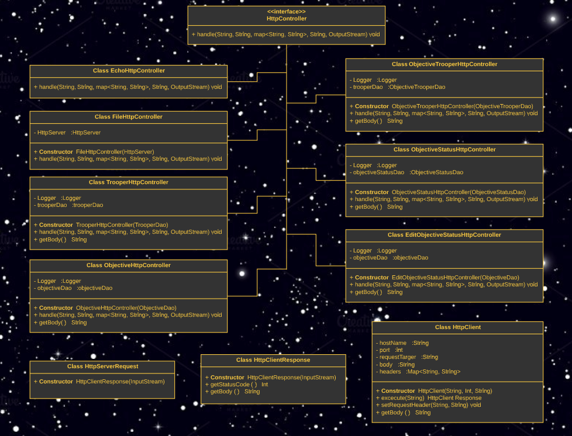
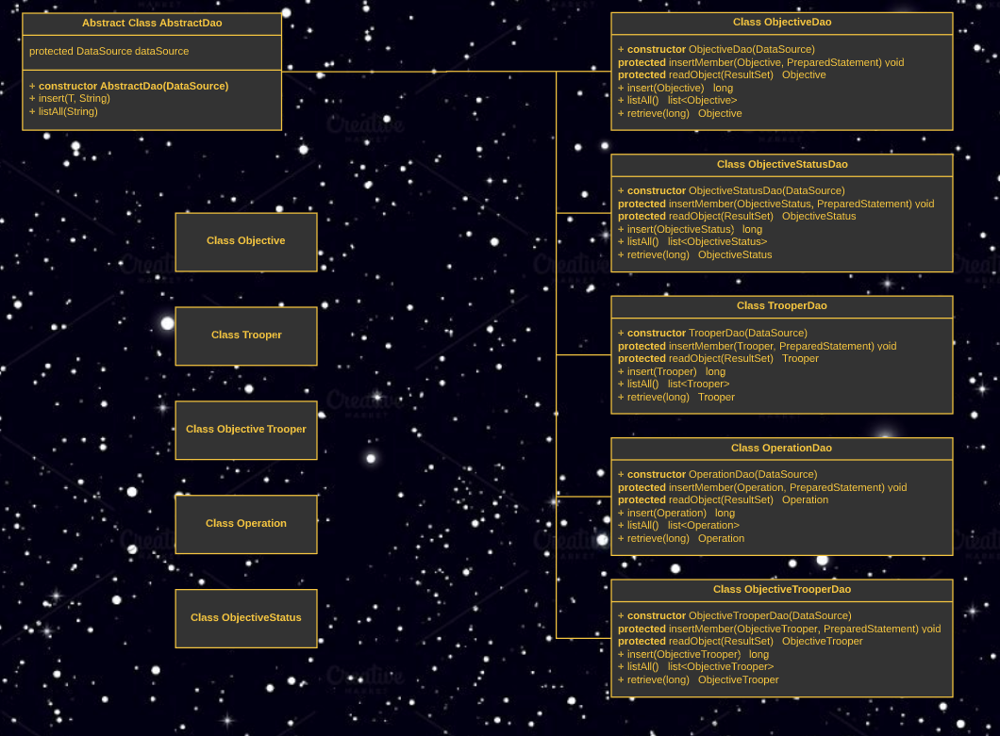
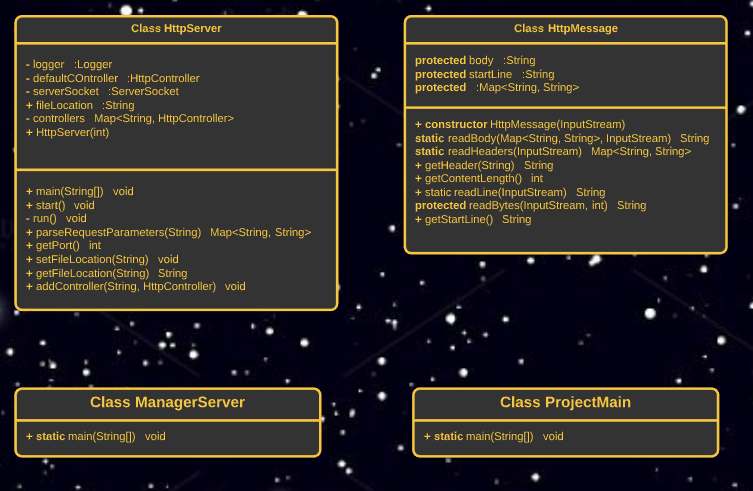

# PG203 Mappeinnlevering for gruppe 123

Link til Github Repository - https://github.com/Westerdals/pgr203-2019-eksamen-Petlas88

NB! Noen av sidene inneholder lyd, så vær obs med volumet!

Vi ville prøve å gjøre denne oppgaven litt morsommere for både oss som har jobbet med den, og dere som skal rette den. Vi har derfor satt den opp i et Star Wars tema, med noen (forhåpentligvis) morsomme elementer. Vi forhørte oss på forhånd med foreleser for sikkerhets skyld og har ungått at dette skal forvirre en eventuell ekstern sensor. Dette temaet fører naturligvis til en del navngivning som ikke helt følger normalen, vi vil derfor klaregjøre litt. Under vil vi liste opp klassenavn, de til venstre er slik de er i oppgaven, og de til høyre er slik man gjerne ser dem ellers.

1.Trooper = Worker, altså arbeidere som kan opprettees

2.Objective = Task, altså en underoppgave i prosjektet (Operation)

3.ObjectiveStatus = TaskStatus, dette er statuser man kan sette til Objectives

Vi har selvfølgelig flere klasser, men disse "prefixene" vil følge over til klassene som er relatert til disse.

Vi ønsker å understreke at selvom frontend delen her er litt opparbeidet, så er dette ikke noe vi har valgt over det å utføre oppgaven, men gjort i de tidsrommene vi har vært så slitne og fraværende at vi ikke lenger klarte å tenke for mye på mer avansert kode.

Arbeidet startet i en separat repository for å unngå og teste at unødvendige filer ikke ble tatt med i den endelige eksamens repositorien da vi har hatt problemer med dette tidligere. Da test prosjektet virket å fungere som det skulle ble den importert i den endelige eksamens repositoriet og arbeidet fortsatte her. Link til denne test repositorien er: https://github.com/Martinius222/death_star
   

## Hvordan kjøre dette programmet

### Bygg og test executable jar-fil

1. Kjør mvn package i terminalen eller velger package fra maven --> lifecycle for å bygge en jar fil
2. Kjør java -jar target/task-manager-exam-1.0-SNAPSHOT.jar i terminalen for å starte programmet

### Funksjonalitet

1. Start programmet via .jar som beskrevet over.
2. Løsningen kan aksesseres i browser via localhost:8080/index.html
3. Brukeren trykker "Add or List Members" for å legge til nye brukere (troopers) og se registrerte brukere.
4. Brukere trykker "Add new status" for å legge til nye statuser for tasks.
5. Brukeren trykker "Add or List Objectives" for å legge til nye tasks (objectives) og se registrerte tasks.
6. Brukeren trykker "Add Trooper to Objective" for å tilegne bruker til task (trooper til objective). 
Dette gjøres ved å legge inn IDen til bruker og task, som man kan finne i listen av hver.
7. Brukeren trykker "List Troopers Assigned to Objectives" for å se listen av brukere som er tilegnet hver task.
8. "Edit Objective Status" skal gjøre det mulig å endre status på tasks, men er per dags dato ikke implementert grunnet bug forårsaket 
av NullPointerException

## Designbeskrivelse

Vi har delt opp løsningen i tre: Http, Dao og Server for å få en mer oversiktlig struktur slik UML diagrammene under viser.

### UML Http:

### UML Dao:

### UML Server:

## Egenevaluering

### Hva vi lærte underveis
Vi har lært mye av prinsippene rundt HTTP og JDBC. Denne oppgaven har på mange måter lagt veien for videre læring. Vi har også lært veldig mye om det å feilsøke kode, da vi underveis har møtt på mange utfordringer. Kurset introduserte hos tidlig til det å parprogrammere som har vært vitalt for å gjennomføre prosjektet. Her er lenke til video fra tidligere innlevering under kurset som demonstrerer parprogrammering i praksis: https://www.youtube.com/watch?v=ArL2xoboJNU&t=98s . Mest av alt har vi lært at ting tar veldig mye lengre tid enn man først ser for seg, og vi burde nok ha startet tidligere, men da vi har hatt andre eksamener ble det litt feilprioritert.
### Hva vi fikk til bra i koden vår
Vi føler at vi har fått til mer enn vi i utgangspunktet trodde vi skulle gjøre, og har gått litt utover minimumskravet. Vi føler at strukturen er jevnt over ganske bra og følger de konvensjonene vi har lært i ganske stor grad. Føler vi har oppnådd det å få en tilstrekkelig forståelse av konseptene som tillater oss å ekspandere litt på koden.
### Hva vi skulle ønske vi hadde gjort annerledes
Som nevnt over skulle vi ha begynt ha tidligere. Vi har underveis møtt på en del utfordringer, og når man er presset på tid fører dette til stress og sene kvelder. Konklusjonen er at vi skulle ha planlagt bedre i forkant av prosjektet. 
## Evaluering fra annen gruppe
Lenke til issues gitt av andre gruppen:   https://github.com/Westerdals/pgr203-2019-eksamen-Petlas88/issues
## Evaluering gitt til annen gruppe
Lenke til issues gitt til andre gruppen:  https://github.com/Westerdals/pgr203-2019-eksamen-Lazboy87/issues
